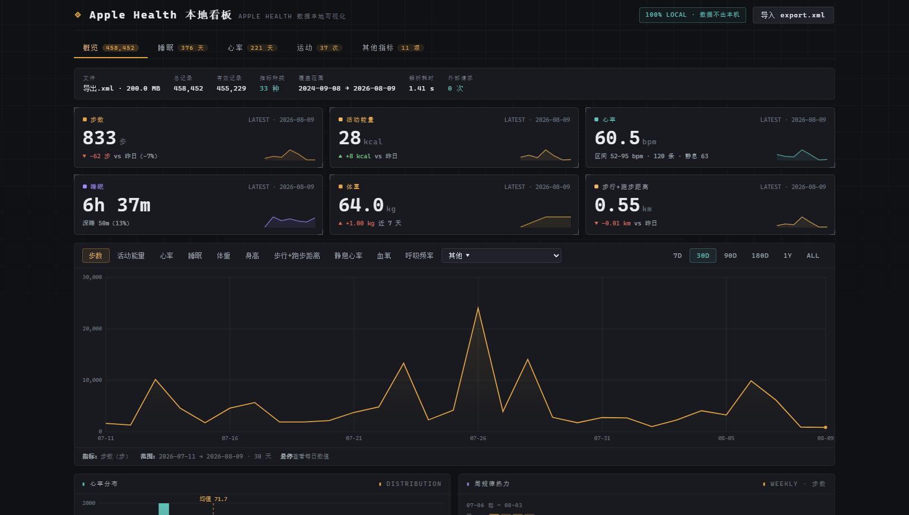
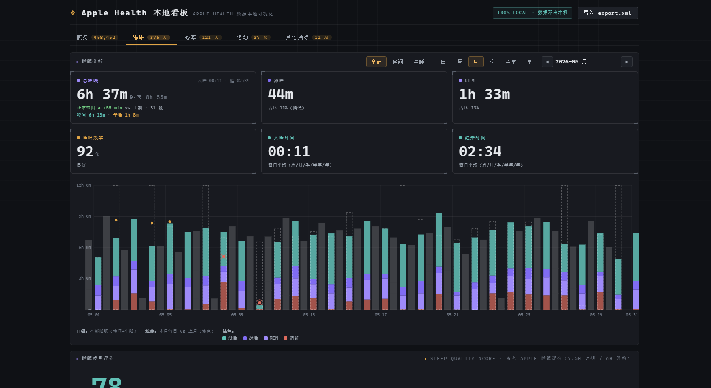

# Apple Health 本地看板

完全本地运行的 Apple Health 数据可视化终端。深色数据风格，**数据解析与渲染全部在浏览器内完成，不联网、不上传、不留存**。

- 入口：`index.html`（需与 `engine.js`、`app.js` 同目录）
- 支持浏览器：Chrome / Edge / Safari / Firefox 较新版本
- 数据源：iPhone「健康」App 导出的 `export.xml`（200 MB 级文件直接拖入）

## 环境要求

| 项 | 要求 |
|----|------|
| 浏览器 | Chrome / Edge / Safari / Firefox（近 2 年版本），`file://` 直接打开，**无需服务器** |
| Node.js | ≥ 18（仅脚本需要：生成样例/自动化验证/健康检查；看板本身不依赖） |
| 依赖 | **零 npm 依赖**，无构建步骤 |
| 网络 | 页面零外部请求，数据不出本机 |

> 接手开发请看 [HANDOVER.md](HANDOVER.md)（能力清单/文件职责/环境/同步指南）。

## 下载即用（GitHub）

1. GitHub 仓库页 → Code → **Download ZIP**（或 `git clone https://github.com/neng320/apple-health-local-dashboard.git`）
2. 解压后双击 `index.html`（任意现代浏览器）
3. 把 iPhone 导出的 `export.xml` 拖入页面即可
4. 已验证：`file://` 双击打开 + 导入 XML 全流程可用（仓库自带 `scripts/_file-protocol-test.js` 可复验）；示例数据 `sample/export.xml`（1.5 年模拟）已包含在仓库，可先体验

> 注意：`export-stress.xml`（75MB 压力数据）与个人真实数据不入库；如需压力测试可 `node scripts/make-stress.js` 生成。

---

## 界面预览

**概览**（数据摘要 / 今日指标卡 / 主趋势图 / 心率分布 / 周规律热力）



**睡眠 · 月视图**（三口径切换 · 阶段堆叠 · 评分历史 · 5.5h / 8h 参考线）



---

## 一、三大核心模块

| 模块 | 内容 |
|------|------|
| **概览** | 数据摘要（总记录/时间范围/解析耗时/外部请求数）、今日关键指标卡、主趋势图（7D/30D/90D/180D/1Y/ALL）、心率分布、周规律热力、数据质量面板 |
| **睡眠** ⭐核心 | **三口径切换（全部 / 晚间 / 午睡）**：晚间 = 18:00–次日 10:30 开始的段，午睡 = 10:30–18:00 开始；日/周/月/季/半年/年粒度（◀ ▶ 切换）；单日时间轴 + 近 30 天堆叠趋势；窗口视图与上期并列对比；**睡眠质量评分表**（参考 Apple：时长 7.5h=100 理想、6h=60 及格，综合效率/深睡/规律加权）；**时长状态分级（<5h 严重不足 / 5–5.5h 不足 / >8h 偏高）**；**睡眠质量历史**（近 90 天评分折线 + 65 分参考线 + 改进建议）；阶段构成卡；**入睡/醒来时间直接展示在总睡眠卡右上角**；近 12 周周均趋势（含 5.5h/8h 参考线与目标线）、**睡眠 × HRV 双轴叠加图**（睡眠期 HRV）、睡眠周规律热力（多块纵向堆叠 + 分级配色）、腕温/目标附加数据 |
| **心率** ⭐核心 | 日/周/月粒度对比；平均/静息/最高/最低/HRV/峰值时段指标卡；区间带趋势图；心率分布直方图；强度分区占比（<60 / 60–100 / 100–140 / 140–180 / >180）；HRV 趋势、静息 vs 步行心率对比 |
| **运动** 🆕 | Apple Workout 记录独立模块：日/周/月/季/半年/年粒度；次数/日均时长/日均能量/平均单次/运动天数指标卡（vs 上期）；按类型着色堆叠柱趋势（悬停看明细）；类型构成占比；运动明细表（时间/类型/时长/能量/距离）；周规律热力 |
| **其他指标** | **通用指标分析模块**：27+ 指标可选（核心：步数/能量/血氧/HRV/静息心率/呼吸/体重/爬楼/锻炼/站立/骑行/步态等；其他：步态不对称/体力活动/声学暴露等）；日/周/月/季/半年/年粒度切换；日均/最高/最低/覆盖天数指标卡；趋势图、**全宽周规律热力**、**全宽周均柱状图**（近 12 周）+ 统计摘要 |

### 睡眠质量评分规则

| 维度 | 权重 | 评分逻辑 |
|------|:---:|------|
| 时长 | 40% | ≥7.5h → 100 分；6h → 60 分；6–7.5h 线性插值；<6h 按 `小时/6×60` 下探 |
| 效率 | 25% | 睡眠时长 ÷ 在床时长；≥90% → 100，80% → 70，<80% 线性下降 |
| 深睡 | 20% | 深睡占比；≥20% → 100，15% → 75，10% → 50，<10% 下探 |
| 规律 | 15% | 近 7 晚入睡时刻标准差；≤15 分钟 → 100，30 分钟 → 85，60 分钟 → 60 |

总分 ≥90 优秀 / ≥75 良好 / ≥60 及格 / <60 待改善。评分随「日 / 周 / 月」粒度联动（单晚 / 窗口均值）。

### 睡眠三口径（全部 / 晚间 / 午睡）

| 口径 | 定义 | 用途 |
|------|------|------|
| **全部** | 晚间 + 午睡全部睡眠段 | 总时间表，卡片同时显示晚间/午睡拆分 |
| **晚间** | **18:00 后 – 次日 10:30 前开始**的段（可延续到 10:30 甚至更晚） | 夜间睡眠质量主表（评分/历史/热力/HRV 均以此为主） |
| **午睡** | **10:30 – 18:00 开始**的白天段 | 单独午睡统计（时长/频率/趋势） |

切换口径后，指标卡、主图、评分、历史、热力、趋势、HRV 全部联动。真实数据实测：晚间日均 5.9h（204 晚，其中 15 晚睡到 9:00 后）、午睡日均 0.7h（27 天）——若只看「全部」，午睡会让部分天的总时长虚高，掩盖晚间睡眠不足的问题。

### 睡眠效率（严格按 Apple 口径）
效率 = 睡眠时长 ÷ 在床时长，**正常范围 0–100%**。严格校验：
- 在床记录缺失 → 显示「—」（不猜测）
- asleep > inBed×1.05（在床记录缺失/矛盾）→ 显示「数据异常」并**不参与评分**（不再出现 >100% 的假效率）
- 微小超差（≤5%，Apple 段边界分钟对齐差异）→ 归一为 100%

实测（真实数据）：晚间口径 204 晚，134 天有效效率（最高 100%）、8 天数据异常、62 天无在床记录（Apple 未记录 InBed 段）；2026-06-18 曾误显 1097% 已修正为「数据异常」/「—」。

### 午睡口径规则
- **不参与评分**：午睡不进入睡眠质量评分与评分历史（评分仅针对晚间睡眠）；午睡口径下评分/历史面板显示说明提示
- **时长分级**：<0.5h 短午睡（青）· 0.5–1h 正常（绿）· 1–1.5h 偏长（琥珀）· **>1.5h 异常**（红，柱顶标记 + 卡片提示）
- 午睡趋势图参考线：正常下限 0.5h / 异常线 1.5h

### 睡眠时长状态分级

| 时长 | 状态 | 表现 |
|------|------|------|
| < 5h | ⚠ **严重睡眠不足**（核心关注） | 柱顶红点+外圈、卡片红色提示、热力深红系 |
| 5 – 5.5h | ⚠ **睡眠不足** | 柱顶橙红点、卡片橙色提示、热力橙红系 |
| 5.5 – 8h | 正常范围 | 绿色提示 |
| > 8h | ⚠ **高于日常**（异常） | 柱顶琥珀点、卡片橙色提示、热力橙色系 |

分级标注覆盖：指标卡、堆叠柱（含 tooltip）、周均趋势（5.5h/8h 参考虚线）、周规律热力（分级配色）、睡眠 × HRV 关联图。

### 在床时长（虚线框）
堆叠柱外围的灰色虚线框表示**在床时长**（含清醒时间），用于观察睡眠效率。为排除异常叠加记录，单日累计在床时长超过 16h 会被截断（引擎层），图表 y 轴最高 12h——不会出现不合理的高框。虚线框显著高于柱体 = 躺床时间偏长 / 睡眠效率低。

### 睡眠 × HRV 关联（双轴叠加）
睡眠柱（左轴 h）与 **睡眠期 HRV**（右轴 ms，仅统计每晚「入睡→醒来」区间内的 HRV 记录，排除白天）叠加在同一绘图区，高度 400px，悬停同时查看两指标。某天无睡眠期 HRV 时回退显示全天均值。

### 周规律热力（多块纵向堆叠）
热力图按容器宽度自动分块：周数多时**纵向堆叠成多个 7 行块**（每块带周范围标签），不再横向溢出；超过 180 天（如 365/420 天）也能完整显示。概述页步数热力与睡眠热力均适用。

### 睡眠质量历史（记录与改进）
「睡眠质量历史」面板记录近 90 天逐日评分（折线 + 优秀/良好/及格/待改善四色带），并给出**近期改进建议**：根据最近 7 天均值自动识别薄弱维度（时长不足 → 建议提前入睡时间；效率低 → 减少卧床清醒时间；深睡不足 → 规律作息与运动）——持续记录即可观察改进效果。

---

## 二、从导出到打开（完整流程）

1. **iPhone 导出**：打开「健康」App → 右上角头像 → 拉到最下方 → 「导出所有健康数据」→ 选择「存储到文件」→ 保存。
2. **传到电脑**：把 `export.zip` 通过隔空投送 / 微信文件传输 / 数据线等传到电脑，解压得到 `export.xml`（约几十 MB 到数百 MB）。
3. **打开看板**：双击 `index.html`（建议 Chrome / Edge），把 `export.xml` **拖入页面**或点击选择。
4. **查看**：页面依次渲染「概览」→ 顶部导航可切换「睡眠 / 心率 / 其他指标」模块。

> 💡 提示：`export.zip` 里还有一个 `export_cda.xml`（临床档案），看板只读取 `export.xml`（健康记录）。

---

## 三、日后更新数据

1. 在 iPhone 上重新「导出所有健康数据」（会覆盖导出当天的全量快照）。
2. 把新的 `export.xml` 拖入看板即可，**旧文件不会被修改**。
3. 同一份原始数据任何时候重新导入，都能复现完全相同的看板（天然回滚）。

---

## 四、隐私与数据安全

- 解析在浏览器本地完成，**全程零网络请求**（页面右下「数据质量」面板会实时显示外部请求数，应为 0）。
- 页面未使用任何 CDN / 远程字体 / 远程接口；关闭页面即清空内存，不留任何数据残留。
- 原始 `export.xml` 只读解析，不覆盖、不删除、不写入。

---

## 五、文件结构

```
health-dashboard/
├── index.html          # 看板页面（结构与样式）
├── engine.js           # 解析引擎（流式块扫描，兼容折行/非自闭合/新旧睡眠编码）
├── app.js              # 看板逻辑（概览/睡眠/心率/其他指标）
├── README.md           # 本说明
└── sample/
    ├── export.xml              # 1.5 年模拟样例（含异常注入，可直接体验）
    ├── export-real.xml         # 你的真实导出数据副本（200MB，可选删除）
    ├── export-answers.json     # 样例的逐日真值（自动核对用）
    └── export-stress.xml       # 32.6 万条压力测试数据
```

### 修改指南

| 想改什么 | 改哪里 |
|------|------|
| 颜色 / 主题 | `index.html` 顶部 `:root` CSS 变量（背景、面板、主色等） |
| 指标卡顺序 / 文案 | `app.js` 的 `renderCards()` / `METRIC_CONF` |
| 睡眠评分权重 | `app.js` 的 `sleepScoreCalc()` 中 `dims` 数组的 `w` 值 |
| 理想 / 及格时长 | 同上 `sleepScoreCalc()` 中 7.5 / 6 两个基准值 |
| 图表配色 | `app.js` 的 `METRIC_CONF` 与 `SLEEP_COLORS` |
| 新增指标类型 | `engine.js` 的 `KNOWN` 表注册类型、单位与聚合方式 |

---

## 六、常见问题

**Q：提示「该文件不是 Apple 健康导出的 XML」？**
确认选择的是解压后的 `export.xml`（而非 `export.zip` 或 `export_cda.xml`）。

**Q：数据导入后睡眠模块没有数据？**
检查导出时间范围是否覆盖睡眠记录（睡眠需 iPhone 开启「睡眠」专注模式或 Apple Watch 记录）；iOS 18 的睡眠记录编码已兼容。

**Q：文件很大（几百 MB）解析多久？**
流式解析按数据量约 1–3 秒 / 200 MB（本机实测：32.6 万条 1.5 秒，45.8 万条 1.7 秒）。

**Q：为什么步数 / 心率数值与手机 App 略有差异？**
看板按 Apple 原始记录逐条聚合（步数求和、心率按天平均/最低/最高），与健康 App 的统计口径一致；差异仅可能来自 Apple 自身的舍入。

**Q：会不会把数据传到网上？**
不会。页面无任何外部请求（可查看「数据质量」面板的实时计数）。

---

## 七、验证记录（开发环境实测）

- 真实导出 200 MB（458,452 条有效记录）：解析 1.71 s，睡眠 376 天、心率 221 天、12+ 类指标，页面渲染正常
- 压力数据 75.5 MB（326,050 条）：Node 解析 1.5 s
- 逐日核对：模拟数据抽样 20+ 天步数/心率/睡眠/体重与真值 0 偏差
- 睡眠评分实测（真实数据）：单晚 6h37m → 81 分良好；周均 5h56m → 71 分及格；评分随日/周/月粒度联动
- 异常容错：缺字段 / 坏值 / 坏日期 / 负值 / 未知单位 / 未知类型 / 长行折行 / 非自闭合标签均不崩溃，跳过并计数
- 隐私：浏览器开发者工具 Network 面板无任何外部请求（页面「数据质量」面板外部请求计数为 0）
- 移动端（390px）：概览 / 睡眠 / 心率 / 其他指标均无横向溢出
